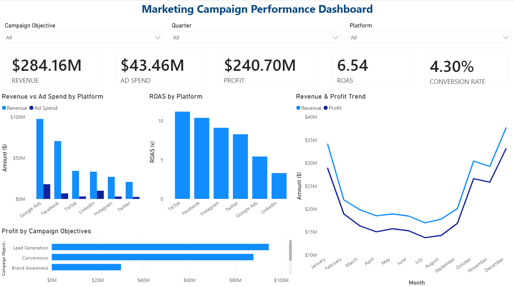
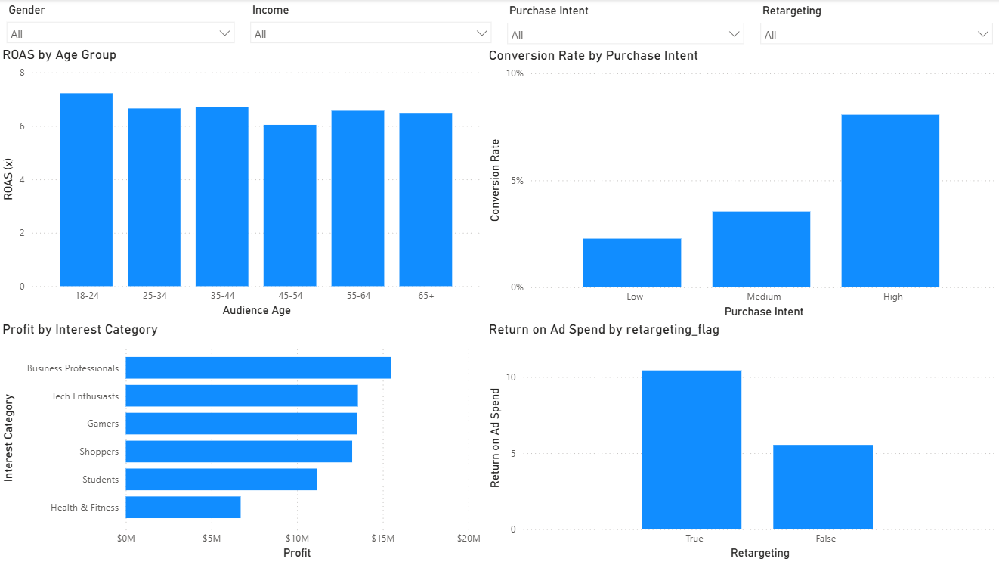
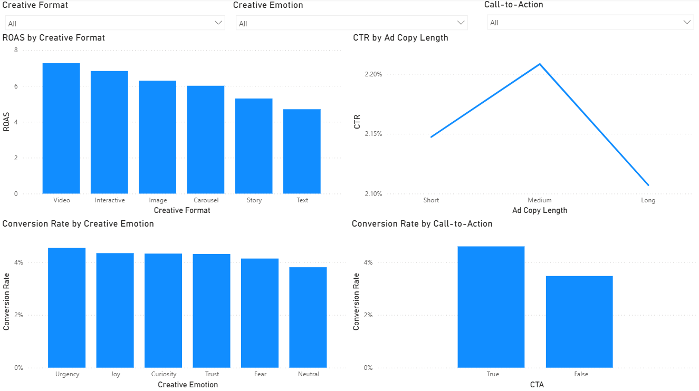

# Marketing Campaign ROI Analysis

An end-to-end marketing analytics project using **Python, SQL, statistical analysis, and Power BI** to evaluate campaign efficiency, audience behaviour, creative performance, and channel-level outcomes.

## 📊 Dashboard Preview

### Executive Overview


### Audience Performance


### Creative & Campaign Analysis


## 🎯 Business Questions

- How efficiently are marketing campaigns converting advertising spend into revenue?
- Which platforms and campaign objectives show stronger ROAS?
- How does performance vary across audience segments?
- How do creative format, copy length, emotion, and call-to-action relate to performance?
- Is there a measurable difference between retargeting and non-retargeting campaigns?

## 🔎 Key KPIs

| KPI | Result |
|---|---:|
| Records analysed | 10,000 |
| Impressions | 705.4M |
| Clicks | 15.26M |
| Conversions | 655,688 |
| Ad Spend | $43.46M |
| Revenue | $284.16M |
| Profit | $240.70M |
| Overall ROAS | 6.54× |
| Overall Conversion Rate | 4.30% |
| Overall CPA | $66.27 |

## 🧪 Statistical Analysis

Retargeting campaigns were compared with non-retargeting campaigns using Welch's independent two-sample t-test.

- Mean conversion rate — retargeting: **5.17%**
- Mean conversion rate — non-retargeting: **3.14%**
- Mean difference: **2.03 percentage points**
- 95% confidence interval: **1.80–2.26 percentage points**
- Welch t-test p-value: **≈ 1.04 × 10⁻⁶⁴**

A chi-square test was also used to examine the relationship between retargeting status and purchase-intent category. The result was not statistically significant (p ≈ 0.427), so the project does not treat that relationship as established.

## 🛠️ Tools & Techniques

**Python:** Pandas, NumPy, Matplotlib, SciPy  
**SQL:** KPI aggregation, segmentation, campaign/platform analysis  
**Power BI:** Interactive dashboards, slicers, KPI reporting, trend analysis  
**Statistics:** Welch's t-test, confidence intervals, chi-square test  
**Analytics:** EDA, funnel analysis, audience segmentation, ROAS/CPA/CTR analysis

## 📁 Project Structure

```text
marketing-campaign-roi-analysis/
├── dashboard/
│   ├── 01_executive_overview.png
│   ├── 02_audience_analysis.png
│   ├── 03_creative_campaign_analysis.png
│   └── README.md
├── data/
│   └── marketing_campaigns_cleaned.csv
├── docs/
│   └── methodology.md
├── notebooks/
│   ├── 01_data_audit.ipynb
│   ├── 02_data_cleaning.ipynb
│   └── 03_eda.ipynb
├── sql/
│   └── marketing_campaign_analysis.sql
├── .gitignore
├── README.md
└── requirements.txt
```

## 🔄 Analytical Workflow

**Data Audit → Data Cleaning → Feature Engineering → EDA → SQL Analysis → Statistical Testing → Power BI Dashboard**

## 💡 What This Project Demonstrates

- Cleaning and validating marketing campaign data
- Translating business questions into measurable KPIs
- Analysing campaign performance with Python and SQL
- Using statistical tests rather than relying only on visual differences
- Building interactive Power BI dashboards for business users
- Communicating analytical findings while distinguishing association from causation
